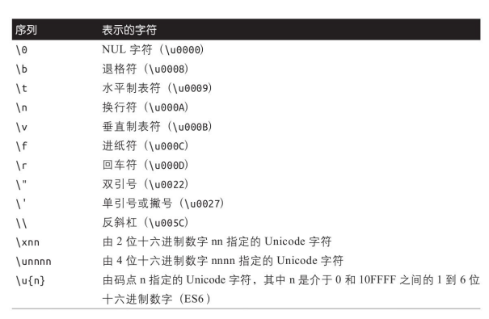

## 基础数据类型

对象类型是可以修改的（mutable），而原始类型是不可修改的（immutable）。

> 字符串的 api 方法都是返回一个新的字符串，而不能修改原始的字符串。

Javascript 有 5 种 基本类型，后续加入了 Symbol、BigInt。

### String

String 类型是零个或多个 16 位无符号整数值（`UTF-16`编码方式）组成，最大长度为 2^53-1 个整数值。字符串的 length 属性是它包含的 16 位值的个数。

一个字符串也可以看作是字符数组，例如可使用 includes、for...of 等方法，按索引访问。虽然能按索引访问，却不能按索引修改（无效）。

由于单个字符表示的范围有限，有些字符（超出 BMP 的部分）需要用到 2 个 16 位值来表示（称为 surrogate pair，即“代理
对”）。在 length 上就会表现为 2，可以使用索引获取每个字符的具体值。但是 for...of 方法获取到的是整个代理对。

```js
const str = "🧡"; // '\ud83e\udde1'
str.length; // 2
str[0]; // '\ud83e'
str[1]; // '\udde1'

const str2 = str + "hello";
for (const val of str2) {
  console.log(val);
}
// 🧡
// h
// e
// l
// l
// o
```

#### Unicode

String 表示使用的是 Unicode 字符集，Unicode 码点范围为 U+0000~U+FFFF，共 65536 个，也叫基本字符区域（BMP）。字符增多后，标准决定以 16 位值组成的字符为一组，一组 65536 个，一组为一个平面，一共 17 个平面，即 0x00 到 0x10。

获取 unicode 值：

- String.prototype.charCodeAt()/String.prototype.codePointAt()
- String.fromCharCode()/String.fromCodePoint()

Unicode 允许用多种编码方式表示同一个字符，就会出现两个字符看起来一样，却并不严格相
等，因为 unicode 编码不一样，这时需要进行 Unicode 的归一化，常用的形式是 NFC。在 js 中可以使用`normalize`方法：

```js
let a = "café";
let b = "café";
console.log(a === b); // false

let a = "café";
let b = "café";
a = a.normalize();
b = b.normalize();
console.log(a === b); // true
```

#### 显示方式

- html，使用`&#x` + unicode 码。
- js，使用`\u` + unicode 码，超出 BMP 区域的需要使用`{}`包裹。
- css，使用`\` + unicode 码。
- css 属性`unicode-range`，使用`U+` + unicode 码。

#### 转义序列

在反引号``包裹的字符中，使用反斜杠`\`加换行符连接字符串时，这两个字符是不算着字符串内容的。



#### 实例方法replace
`replace(pattern, replacement)`
- replacement为string时，支持一些特殊字符效果：`$$` `$&` `` $` `` `$'` `$n` `$<name>`
- 当replacement为function时，参数为(match, ...pN, offset, string, groups?)，其中groups只有在pattern拥有具名捕获组时才会存在，否则无此参数。

### Number

Javascript 中使用基于 IEEE754 标准的双精度浮点数来表示数字，标准规定一个数的二进制表示法为`(-1)^S * 1.M * 2^E`，结构如下：

- `1` 符号位 sign bit，用来表示正负号
- `11` 指数位 exponent，用来表示次方数
- `52` 尾数 mantissa，用来表示精确度


> 32 位结构对应，S:1/E:8/M:23。

> 0.1 + 0.2 运算不标准的原因就在于有的数（比如 0.1）用该方法表达时是无穷的，必须进行截断，所以不精确。而此运算，有 2 次的舍入，造成了精度丢失很大。比较大小正确的方式是检查等式左右两边差的绝对值是否小于最小精度：
> `Math.abs(0.1 + 0.2 - 0.3) <= Number.EPSILON`，`Number.EPSILON === 2 ** -52`

> 一个数用科学技术法表示时，小数点位置可变化（增大或者减小指数位），这样的表示法叫浮点数表示法。优点是，可以合理利用内存空间，而定点数表示法太死板，容易造成空间的浪费。

> 指数位是无符号的，但是又要表示负数，因此指数位默认是加上了中间数后的结果。32 位单精度浮点数对应的是 8 位指数位，中间数是 127，实际表示范围为`-127 ~ 128`，64 位则对应 11 位指数位，中间数 1023，表示范围位`-1023 ~ 1024`。

除了正常的计算，还有一些特殊值的设置。

- 0 或者很小的数，指数位 E 全 0，尾数非 0，这时尾数隐藏位不为 1，为 0。
- 正无穷/负无穷，指数位 E 全 1，尾数全 0。（因此 Infinity 属于 number 类型）
- NaN，指数位 E 全 1，尾数非 0。（因此 NaN 属于 number 类型）

js 可表示的安全整数范围为`2 ** 53 - 1`，安全即表示一个数有唯一的浮点数表示与其对应。不安全则表示，多个不同的整数被同一个浮点数表示与其对应。

字面量可使用下划线作为分隔符，让其更容易人为识别。

有些 api 在 Number 类和全局上都有，例如 isNaN、isFinite 等，这是最好使用 Number 类上的方法，判断更为严格。

#### 进制转换

`0b`开头二进制，`0x`开头 16 进制。

- 10 进制转 n 进制，`Number.prototype.toString([radix])`
- n 进制转 10 进制，`window.parseInt(string, radix)`

#### `toFixed()`
小数点会进行四舍五入。
#### `parseInt()`、`parseFloat()`
可以处理16进制`0x`字符串，不能处理8进制`0o`。

### Boolean

`''`/`undefined`/`null`/`0`/`+0`/`-0`/`NaN`/`false`使用 Boolean 转换后，均为 false。

### undefined

`undefined`既是全局的一个变量（以前可更改，现在变成了 no-configurable、no-writable、no-enumerable）,也是全局变量`undefined`的值，也就是全局变量`window.undefined`的值为`undefined`。

任何变量未赋值之前都是 Undefined 类型，且值为 undefined。而我们常用 undefined 这个全局变量来表示它，或者用 void 运算来产生一个 undefined**值**。

> void 是一个运算符，对给定的表达式求值，然后返回 undefined(这里指的是值，而不是那个叫做 undefined 的全局变量)。

### null

null 是一个语言关键字，求值为一个特殊的值，通常用于表示某个值“没有值”。表示这个变量未指向任何堆对象，常用于主动 GC 回收。

> `typeof null === 'object'`的梗。在 JS 的最初版本中使用的是 32 位系统，为了性能考虑使用低位存储变量的类型信息，000 开头代表是对象，然而 null 表示为全零，所以将它错误的判断为 object 。虽然现在的内部类型判断代码已经改变了，但是对于这个 Bug 却是一直流传下来。

### Symbol

表示一个独一无二的值，直接使用不带 new 的构造函数生成。

`Symbol.for()`则会一直返回同样的值。

### 类型转换
值得注意的几个转换。

- 转数字：
  - `undefined -> NaN`
  - `null -> 0`
  - `[] -> 0`
  - `[1] -> 1`
  - `[1, 2] -> NaN`
  - `' 3 ' -> 3`
- 转布尔值，`Infinity -> true`

#### 对象到原始值的转换

转字符串：
- `toString()`
  - 原始值，使用此原始值转为字符串
  - 不存在或者返回Object，使用`valueOf()`
    - 原始值，使用此原始值转为字符串
    - 报错TypeError

转数字，跟字符串一样，先尝试`valueOf()`，再尝试`toString()`。

无偏好时，除了Date（偏向于转字符串算法）以外的对象，都偏向于转数字算法。
